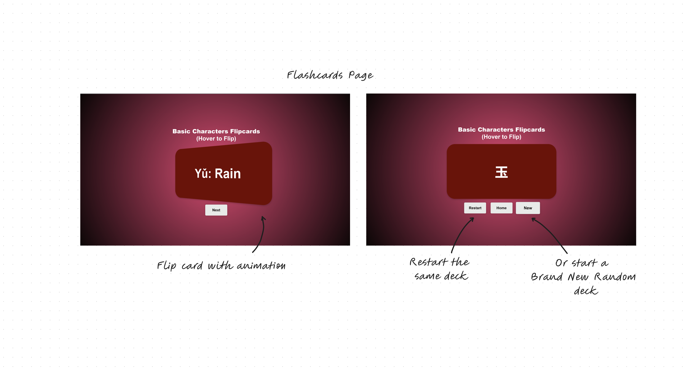
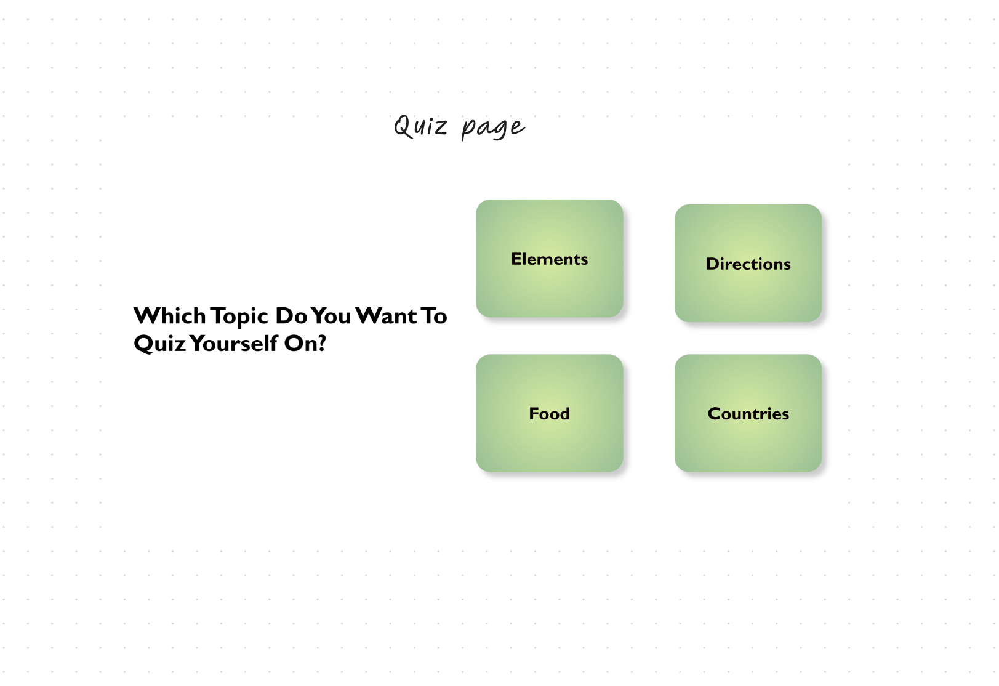

# PracticeMandarin
MVP: Simple website to practice Mandarin for beginners

 ## Features
 - Adjusts according to device screen size 
 - Flippable flashcards to learn and recognise characters
     - Each time, the set of flashcards is randomly created from a given set of values
     - The number rabges from 1 up to 9
     - To add: <Improvement> Connect with a DB to increase and organise flashcard pool

 - A new random Chinese character (with meaning) appears on homepage each time it is loaded
     - To add: <Feature> Create a bigger image pool
     - To do: <Improvement> Move pool from Google Cloud to better alternative

 - Practice Quizzes
     - To do: <Improvement> Use something other than Google Forms

Goal: Create a fully fledged host-able website

## Current Look:

